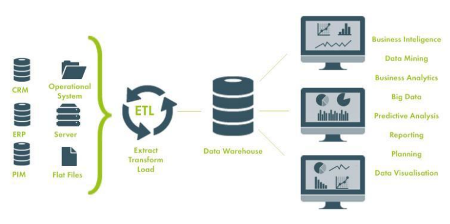

# Ciencia de datos

### ¿Qué es la Ciencia de Datos?

* La ciencia de datos es una diciplina que se encarga de extraer conocimiento a partir de los datos.
	- En muchas ocasiones es necesario ser proactivo en la captura de datos
* Es multidisciplinaria:
	+ Computer science:
		- Estructuras de datos
		- Algoritmos
		- Visualización
		- Big Data support
		- Programming
	+ Estadística
		- Regresiones
		- Inferencias
	+ Conocimiento del dominio
		- Preguntar lo correcto
		- Interpretar los resultados
* Este campo se auxilia de muchos otros campos:
	+ Bases de datos
		- SQL y NoSQL
	+ Análisis de texto y Procesamiento de lenguaje natural
	+ Análisis numérico de datos y minado de datos
	+ Análisis de redes
	+ Visualización de datos
	+ Machine Learning e Inteligencia Artificial
	+ Análisis de señales digitales
	+ Análisis de datos en la nube (Big Data)

### Roles en la ciencia de datos

1. Data engineer
	- Se encarga de obtener los datos
	- Limpiarlos y estructurarlos para posterior análisis
	- Crear pipelines de análisis automatizado
	- Utilización de herramientas en la nube
	- Análisis descriptivo de los datos
	- Background: Software engineering
1. Data scientist
	- Análisis matemático de los datos
	- Identificación de variables relevantes para el negocio
	- Generación de modelos predictivos y prescriptivos
2. Machine Learning engineer
	- Creación de sistemas predictivos y prescriptivos de gran escala
	- Mantenimiento y ajuste del modelo

### Tipos de datos

- Primitivos
	- _int, str, bool, float, hex, oct, datetime, objetos especiales
- Estructurados
	- _Bases de datos
	- _Data warehouses
- Semi estructurados
	- _JSON APIs
	- _Datos tabulares (csv, excel)
- No estructurados
	- _HTML
	- _Texto libre
	- _Curriculum vitaes
	- _Imágenes, audio, social media
	- _Datos científicos
- Cualitativos vs cuantitativos
- Tiempo real vs históricos

### Fuentes de datos

- Web
- APIs
- Datasets
- System logs
- User analytics
- Sensor data
- Y muchos más...

### ETL

1. Extract
	- Es el proceso de lectura de datos de diversas fuentes
		- Bases de datos de aplicaciones
		- CRM
		- Archivos CSV
		- Datasets publicos

1. Transform
	- Es el proceso de limpieza de datos para su posterior inserción en un data warehouse
		- Limpieza
		- Estructurado
		- Enriquecimiento

1. Load
	- Es el proceso de inserción de datos al data warehouse
		- Depende del tipo de solución que se haya escogido

### Adquisición de datos

